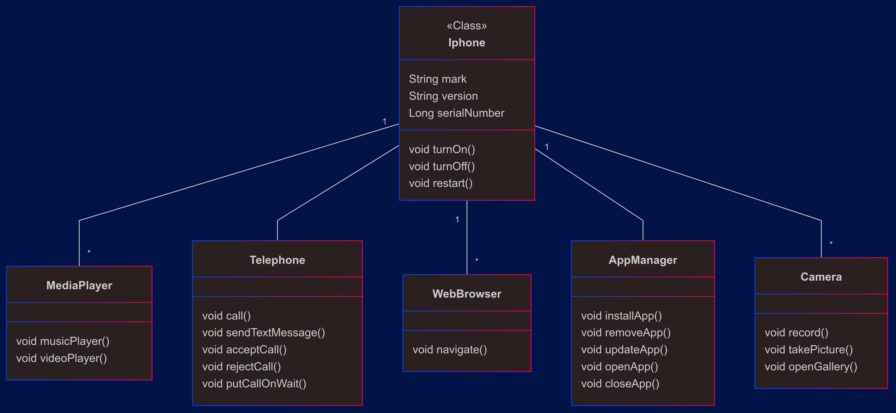

## Dio Iphone Project

Esta é uma implementação simples de um Iphone em Java, onde foi construída a classe Iphone e foram implementadas as interfaces MediaPlayer, Telephone, WebBrowser, AppManager e Camera neste modelo pois definem os contratos a serem seguidos, abrindo a possibilidade de outra(s) classe(s) definir como serão utilizados os recursos.

## UML Diagram

Abaixo temos o modelo em UML criado para a implementação:

